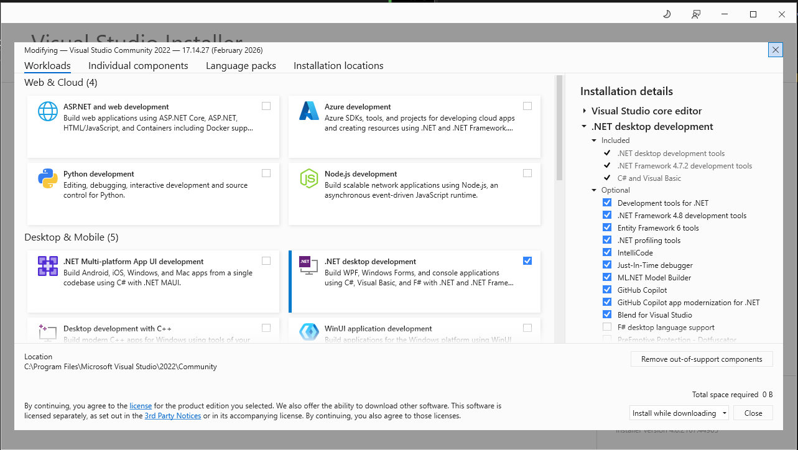
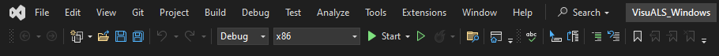

# Development Setup
This document describes how to set up a development environment for the project.

## Setup Visual Studio

### New Install
1. Install (Visual Studio Community Edition)[https://visualstudio.microsoft.com/]
2. In the installer, select ".Net desktop development"

### Existing Install

1. Open the Visual Studio Installer
2. Select "Modify"
3. Add the ".Net desktop development"

## Install Inno Setup

1. Download and install (Inno Setup)[https://jrsoftware.org/isdl.php]

## Clone Repository & Setup Project

1. In a terminal, navigate to your repository folder
2. Clone the repository `git clone git@github.com:VisuALS-Technologies/visuals-windows.git`
3. Open the solution file `visuals-windows\src\VisuALS_Windows.sln` in Visual Studio
4. In the Visual Studio toolbar, change the build config to "Debug" and the target to "x86"

