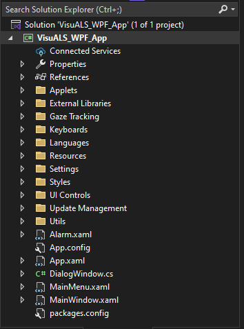
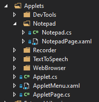
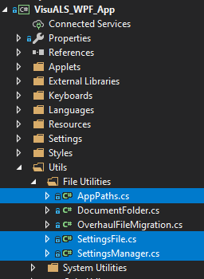
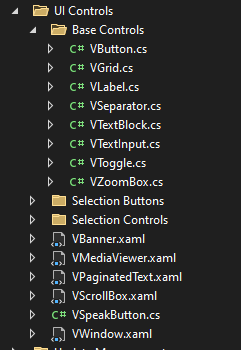
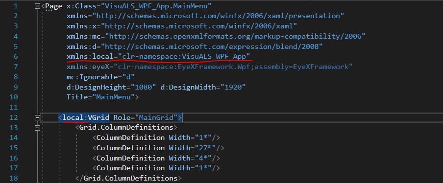
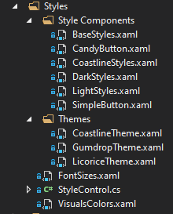
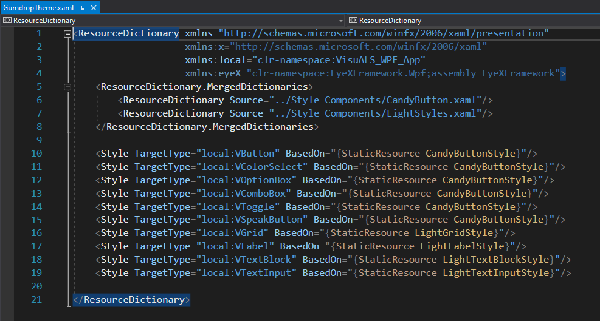

# **Introduction**

In this document I will describe the folder structure of our application, what the different files, classes, and structures do, and how execution in the application happens. When you first open the project it should have a folder structure similar to this:

Within the base VisuALS\_WPF\_APP folder there are many folders, subfolders, classes, etc. below is a large but not totally comprehensive list of these along with brief explanations

- **Applets**: Contains all applet files and base classes

  - **Applet Folders**: The subfolders of the Applets folder each represent one applet

  - **Applet.cs**: The base class for all Applet classes

  - **AppletMenu**: A control for selecting and launching applets

  - **AppletPage.cs**: The base class for all pages within applets

- **External Libraries**: Contains some needed DLLs

- **Gaze Tracking**: Contains classes related to gaze tracking.

  - **EyeBall.cs**: This class implements the visible “cursor” that follows your gaze, affectionately dubbed the EyeBall.

  - **IGazeTracker.cs**: The base interface for all eye trackers.

  - **GazeTrackerManager.cs**: A static class for managing all available eye trackers.

  - **MouseGazeSim.cs**: Simulates a gaze tracker using the mouse cursor (for testing purposes).

- **Keyboards**: Contains all files and classes related to the modular keyboard control

  - **Keyboard Bars:** This subfolder contains the Keyboard “Bars” which includes the top predictor bar and the bottom navigation bar (the latter of which also has the spacebar and clear button). These derive from VKeyboardTab.

  - **Keyboard Framework**: This subfolder contains base classes for the keyboard system, the VKeyboard control itself, and some other important parts of the keyboard system.

  - **Keyboard Tabs**: This subfolder contains all the keyboard tabs, for instance, the main tab of the keyboard may be the QWERTY tab, then there are also Special Character tabs for punctuation and numbers, and the Cursor Control Tab for moving the caret.

  - **KeyboardManager.cs**: This class is used for querying for existing keyboard layouts and tabs, getting the suggested or current layout, and dealing with serializing and deserializing custom keyboards (which are not yet fully supported).

  - **Predictor.cs**: This class is a static class for querying the text prediction database (and/or common word list) for word predictions as well as for training the database based on text the user types. The VPredictionButtonsBar uses this class.

- **Languages**: This folder contains the language dictionaries for supported languages as well as the LanguageManager for managing the current language.

  - Language Dictionaries: The .xaml files in the Languages folder are the language dictionaries. Each one contains all the translations for a given language, associating that translation with a key. These keys have a short 2 or 3 letter prefix denoting the applet, page, or context that the translation is used in.

- **Resources**: This folder contains images, text, sound files, and other media, including the Text Prediction databases.

  - Images

  - **Text Prediction**: Resources associated with Text Prediction, namely the text prediction databases, common word lists, and license file for the common word lists.

  - **Text To Speech**: Resources associated with TTS, namely the initial phrases for each category.

- **Settings**: This folder contains all the settings pages, including the settings menu. These pages each have their own SettingsFile object and an InitializeSettings method so they each maintain the settings they deal with. The InitializeSettings methods are static and called by MainWindow in it’s constructor.

- **Styles**: This folder contains all xaml and classes related to styles and theming.

  - **Style Components**: The building parts for themes, each of the files in here contains one or more styles with keys.

  - **Themes**: Each file in this subfolder represents an entire theme. They are applied by adding them to the App’s ResourceDictionary which is done by the StyleControl class.

  - **FontSizes.xaml**: A file containing each of the font sizes, they are referenced by key.

  - **StyleControl.cs**: A class for dealing with the style and theming, including changing the theme and changing the overall font size.

  - **VisualsColors.xaml**: A file containing all the colors used for styling.

- **Update Management**: A folder containing classes and files associated with managing updating the VisuALS application.

  - **Update Logs**: A folder containing line separated text files which list the new changes in an update. The files should simply be the number of the new version they are associated with, and should have not extension (ie. no “.txt”)

  - **OverhaulFileMigration.cs**: A class to help with moving files and cleaning up when updating to the new folder structure and settings system.

  - **UpdateNews.cs**: A class for finding, formatting, and displaying the new changes after an update. Naturally this draws from the files in the Update Logs folder.

- **Utils**: Contains miscellaneous classes, especially ones which are likely to be needed in many parts of the app, or don’t seem to fit anywhere else. If you’re having trouble finding something, or if you want to check to see if a class has been made to do something already, don’t forget to look here in addition to other more obvious places.

  - **File Utilities**: A subfolder for utility classes related to file manipulation, writing, reading, etc. including files for the settings system, as well as the AppPaths class for important file paths, and the DocumentFolder for easy dealing with a folder of text files.

  - **System Utilities**: Contains classes associated with the computer itself, including simulating keyboard and mouse inputs, controlling display brightness (not functional currently), and controlling volume.

- **UI Controls**: Contains all the basic UI Controls to be used in the rest of the app. This includes things like the VButton which is used for all buttons in the app.

  - **Base Controls**: The most basic controls that are typically analogs to standard WPF controls and are derived directly from them.

  - **Selection Buttons**: These are all derived from the VButton but when pressed they bring up a specific SelectionControl in a dialog window. This helps cut down on the number of subpages in the app by allowing users to select a value from a dialog window instead of from a separate page.

  - **Selection Controls**: These are controls for selecting a value, including typing text, picking from a list, choosing a color or a number, etc. All of these derive from the base VSelectionControl. They emit a value changed event when the user selects a value, and the new value can be retrieved from the SelectedItem property or the SelectedItemName property for a string representation of it.

- **Alarm**: This is the alarm page.

- **App.config**: A project configuration file. You shouldn’t normally need to mess with this.

- **App**: This is the class representing the entire application. It’s XAML file contains code for importing the application-wide styles. It’s C\# file contains code for initializing the application.

- **DialogWindow.cs**: A class that mediates creating and displaying dialog windows inside the app. These are not actual dialog windows, but our version of them which can be clicked with the eye tracker.

- **MainWindow**: This is the class that represents the main application window. Although it represents the window itself it also has some GUI elements. It has the bottom navigation bar and a frame that holds the contents of the current page. The main window takes care of initialization that the App class cannot. It also takes care of dialog windows, pausing/resuming, and fullscreen/not-fullscreen modes. 

- **MainMenu**: This is the first page that is loaded into the main window. From the main menu users can navigate to applets or to settings.

- **packages.config**: A project configuration file which lists nuget packages to include in the application. You shouldn’t usually need to mess with this as you should use the Nuget Package Manager if you need to add or update a nuget package (you can do this by right clicking on References and selecting “Manage Nuget Packages…”)

# 

# **Applets**

In the latest development the different functions of the VisuALS application such as the notepad or web browser are called “applets”. All files for a given applet are stored in their own folder under the main Applets folder like so:

Applet.cs contains the definition for the Applet class. Each applet has its own subclass of this Applet class which contains information like the name of the applet, as well as a function for starting the applet.

AppletPage.cs contains the definition for the AppletPage class. All pages in an applet are required to be AppletPages instead of the normal Page class. This allows applet pages to have direct access to the definition of the applet they belong to and some necessary resources.

A simple single page application like the Notepad (shown in the picture) may have just two things in it. These would be the AppletPage and the Applet. Notice that the Applet class for an applet should be the name of the applet whereas the main page should be in the form AppletnamePage. Any other utility classes that are specific to the application should also be included in the applets folder, such as the AudioRecorder class which is stored in the Recorder applets folder.

All applet classes have two [SettingsFile](#settings) objects by default named Config and Session.The config settings file should be used to store settings for the application (such as which style of web browser to use) whereas the session settings file is used to store data to keep things the way they were even after closing and reopening the app (such as storing the current text typed in the notepad applet that way it’s still there when you close and reopen the app).

# **Settings** {#settings}

Settings for the VisuALS application are stored in [JSON](https://www.w3schools.com/whatis/whatis_json.asp) files under the AppData/local/VisuALS folder. There are several important utility classes for dealing with these settings files. These classes are located under Utilities/FileUtilities:

The SettingsManager is a static class with functions for getting and setting data if you know the path to your settings file. The SettingsFile class is not static. When you create an instance of SettingsFile you pass in the path to the file and then it provides functions for easily accessing data without having to keep giving it the path. AppPaths is a static class containing paths to important folders for the VisuALS application, including the base settings folder. Most of the time the SettingsFile class is used since it is a simpler interface.

# **VisuALS UI Controls**

Most GUI elements used in the VisuALS application are custom elements. Most of the base elements are located under the UI Controls folder.

Most of the elements have names starting with a “V” to distinguish them from their standard WPF counterparts. These custom elements are used to implement common functionality that we need across the app. In addition to this, much of the layout and styling for the base elements is taken care of by application-wide styles. You should always use these custom controls with very very few exceptions. If you think you need new functionality not provided by current elements, then create a new custom element to implement the functionality. 

When using these elements in XAML you will have to prefix their names with *local:* which is the namespace you are using (you can see the namespace declarations at the top of the XAML file, the local namespace should have been created automatically if the page object was created from the menu like normal). The declaration and prefix are underlined in the image below:

# **Style System**

There are two parts to the styling system for the VisuALS application. The first is the Role System which most base VisuALS Control Elements have. This system allows for semantic styling of elements (such as coloring speech-related buttons orange and web-related buttons blue). The second part is the Theme System.

There are currently 5 base control elements with a Role property. These are:

* VGrid  
* VButton  
* VLabel  
* VTextBlock  
* VTextInput

Each of these has a unique Enum role type, for instance VButton has an associated ButtonRole type, and thus the VButton class has a property of type ButtonRole named simply Role. These role enums have values associated with the use-case of the control. For instance, the button role “Speech” is used for buttons related to speech and the button role “Navigation” is used for next/back buttons and similar. In the case of grid there are roles like “MainGrid” which should be used only for standalone pages or “ControlGrid” which should be used as the main grid for UserControls.

The theming system is a bit layered. All styling and theming related content is kept under the Styles folder:

The Style Components folder contains resources for creating themes. Each of the files in Style Components is an XAML file containing one or more Styles, each of which should ALWAYS have a key (the key makes it so that the style must be referenced directly, otherwise it is automatically applied to relevant controls if it is included in the XAML where those controls are located). These styles can then be referenced in the Theme files.

The Themes folder contains all the different available themes. Each theme is contained in exactly one XAML file and contains the appropriate styles for all base controls. These styles should NOT have keys, and should generally be simply derived (ie. BasedOn) from the Style Components, like so:

As you can see, the necessary style components files are included near the top (this is the ResourceDictionary thing), and then a style for each base control is provided with no key and derived directly from one of the style components.

Thus the flow here is that the style components provide a sort of palette of styles from which to build themes.

Another thing to notice is FontSizes.xaml and VisualsColors.xaml. These provide the different font sizes and custom colors respectively. The font sizes, after being added to the application resource dictionary, are actually changed at run-time which then affects all controls since all controls should be using those listed font sizes in their styles. You should also always use the Visuals colors for any colors you use, and if you need colors not present, simply add them to that file (currently one exception is the Transparent color, which is used in styles but not from the VisualsColors file, but this will probably be changed in the future).  

The StyleControl.cs file contains a static class for manipulating styles. Specifically it provides a way to change the font sizes and theme. It does not, however, store these changes in a settings file, this is done by the DisplaySettings page itself.